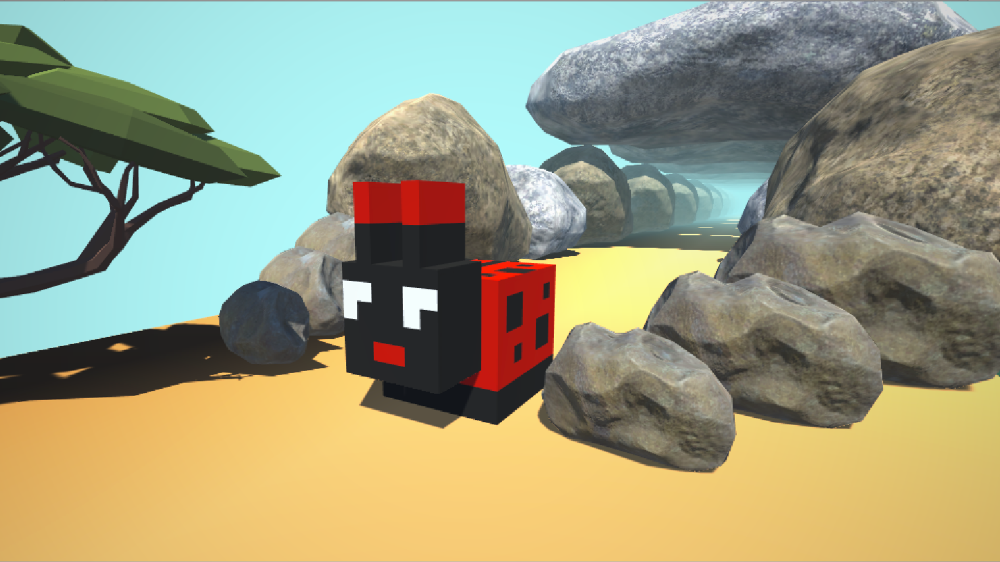

### keeda-github-game-off-2021

This is a game based on the theme Bug for the GitHub Game Off 2021 Jam on Itch.io

## Installation
- Clone this repository to your local machine.   
- Open up **Unity**, select cloned folder. Now Unity will do all the necessary processing.  
- You would be greeted by a **default** scene in *Unity*.
- Go to **Project** tab, select **Assets** folder
- Then select **Scenes** folder and *double click* on **Menu** scene
- Now *Menu* will load into the **Game** tab and you can run the game from here onwards,  
  by clicking on the *Play* button on top of it (or press ctrl + P)
   
### Download KeeDa.exe
- You can download this game directly from itch.io website.
- By clicking on the link below you will be directed to the Game page for KeeDa on itch.io
- After downloading, you'll get a **_KeeDa x86.zip_** file you can *extract* it using **WinRAR** or **7-Zip**
- Now you can Play the game **KeeDa.exe** file with thr *red KeeDa (Bug)* icon on it.  
Link : [**Download KeeDa from itch.io**](https://itch.io/jam/game-off-2021/rate/1299303)  
 _If you have taken part in Game Off 2021 you can even **Rate** this game at the first page that  
 opens up(it's the Game Jam Rating Page)._  
 _You can even rate this game on **main** game page if you haven't been part of this game jam._
 
 
 _But the most valuable is your **feedback** & **interaction** with me in the **comment section**._  
 _Hope you'll enjoy!_ :thumbsup:

#### Socials 
Feel free to ask any questions or give feedback :smiley:  
Twitter : [_code4Y](https://twitter.com/_code4Y)
